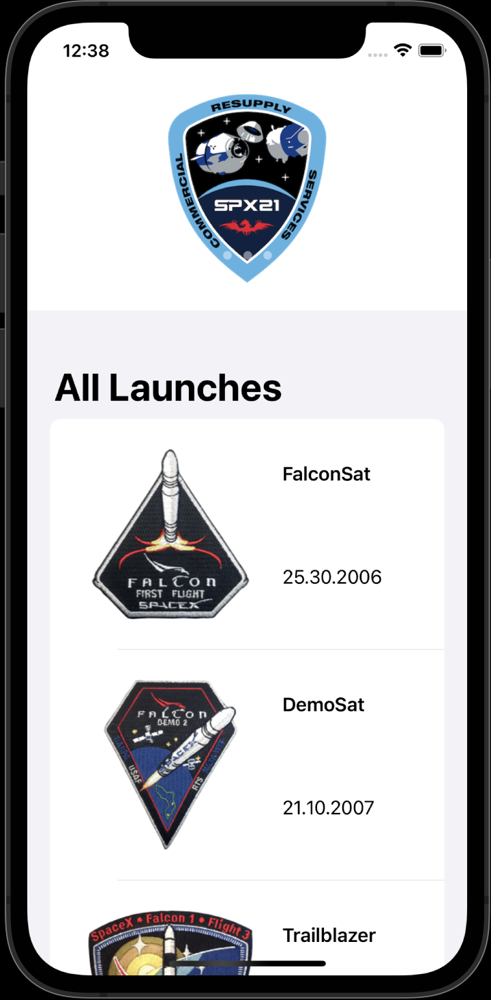
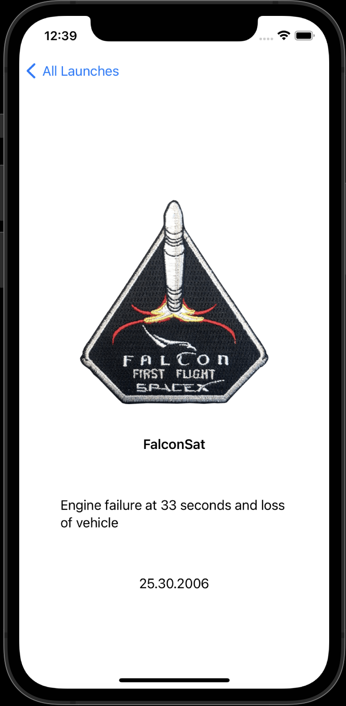

## SpaceX Launches

This application is a simple rocket launch application. It uses the SpaceX API.

Slider Data -> https://api.spacexdata.com/v4/launches/upcoming

List Data -> https://api.spacexdata.com/v4/launches

Detail Data -> https://api.spacexdata.com/v4/launches/{flightNumber}

<table class="image-table">
<tbody>
<tr>
<td>
</td>
<td>

</td>
</tr>
</tbody>
</table>

:green_circle: Alamofire for Rest API

:green_circle: Kingfisher for Image View

:green_circle: Swift Package Manager for libraries. There is an incompatibility with SwiftUI using Alamofire and Kingfisher.

:red_circle: Codeable instead of SwiftyJSON.

:green_circle: Clean request manager.

:green_circle: Architecting app with MVVM.

:red_circle: Listing Pagination.
